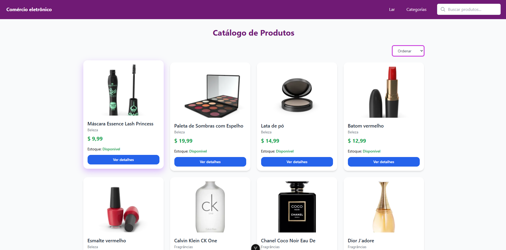
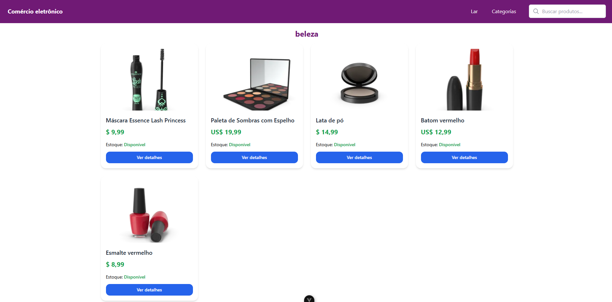
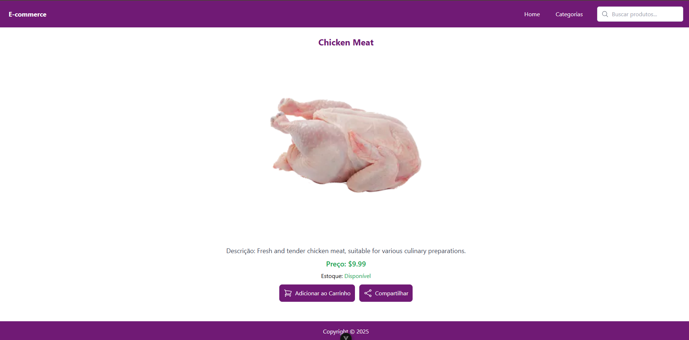

# E-commerce
Este projeto consiste em uma plataforma de e-commerce integrada a uma API pública que fornece uma variedade de produtos, suas categorias e diversas funcionalidades associadas.

O sistema conta com uma barra de navegação (NavBar) presente em todas as páginas, que inclui um link para a página inicial, um menu de categorias e um campo de busca.

Na página inicial, é exibido o Catálogo de Produtos, que apresenta todos os itens disponíveis na API, organizados com sistema de paginação. Além disso, o usuário pode personalizar a exibição dos produtos, ordenando-os por menor preço, maior preço, ordem alfabética crescente (A-Z) ou decrescente (Z-A).

Ao passar o cursor sobre a aba "Categorias", um menu suspenso exibe todas as categorias disponíveis. Ao selecionar uma delas, o usuário é redirecionado para uma página dedicada, que mostra somente os produtos daquela categoria.

O sistema de busca permite localizar produtos pelo nome em tempo real, atualizando os resultados conforme o usuário digita no campo de pesquisa.

Ao clicar em "Ver Detalhes" em qualquer produto, o usuário é direcionado para uma página exclusiva do item, onde são exibidas informações detalhadas como nome, preço, descrição técnica e estoque disponível. As funcionalidades de adicionar ao carrinho e compartilhar serão implementadas em versões futuras.

## Página Inicial



## Categorias



## Produto


__________________________________________________________
## Como Executar o Projeto Localmente

```sh
Garanta que tenha o node.js instalado em sua máquina. 
```

```sh
Clone o projeto com git clone https://github.com/oliveira191205/E-commerce.git
```

```sh
Abra o terminal(cmd) dentro da pasta descompactada
ou
com o comando cd E-commerce 
```
```sh
Instale: npm install
```


```sh
Execute: npm run dev
```

```sh
Selecione a tecla "o" e a plataforma abrirá no navegador
```
Criamos um vídeo demonstrativo que apresenta as funcionalidades do projeto e orienta sobre seu uso. Você pode assisti-lo em: https://youtu.be/s8RxKX76qys?si=RYpJYRhlbNpwC4Ak


## Projeto Desenvolvido Por 
```sh 
Larissa Vitória Custodio de Carvalho RA:1995354
Marcela Buzzo de Oliveira RA:2014340
```
